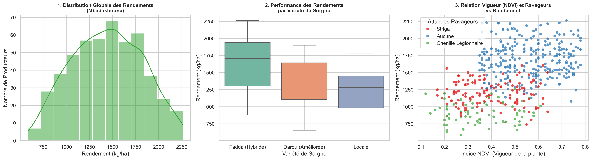
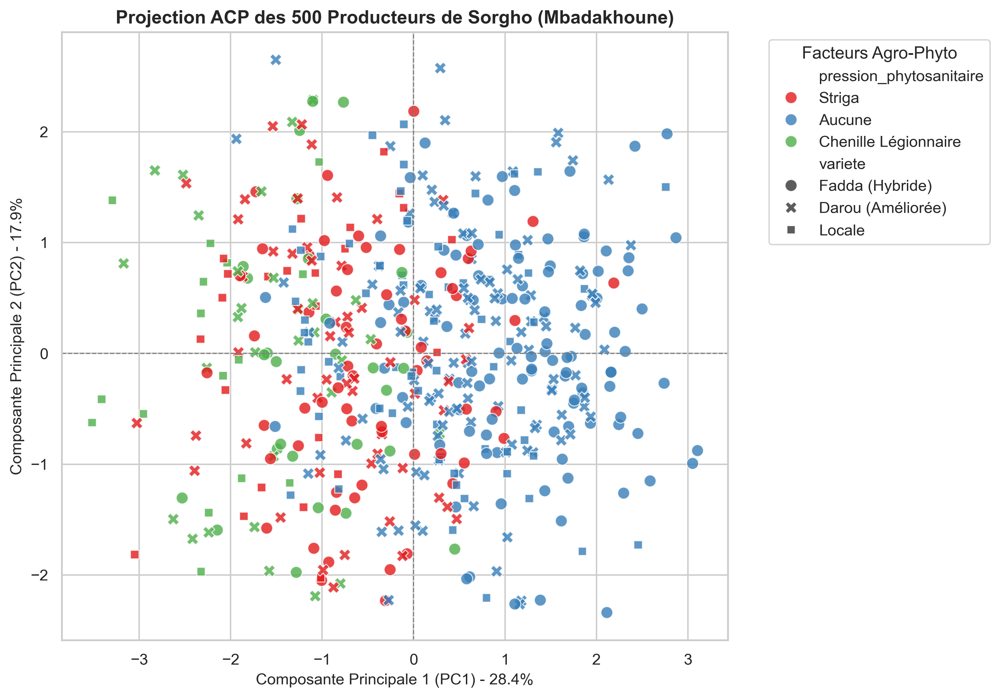
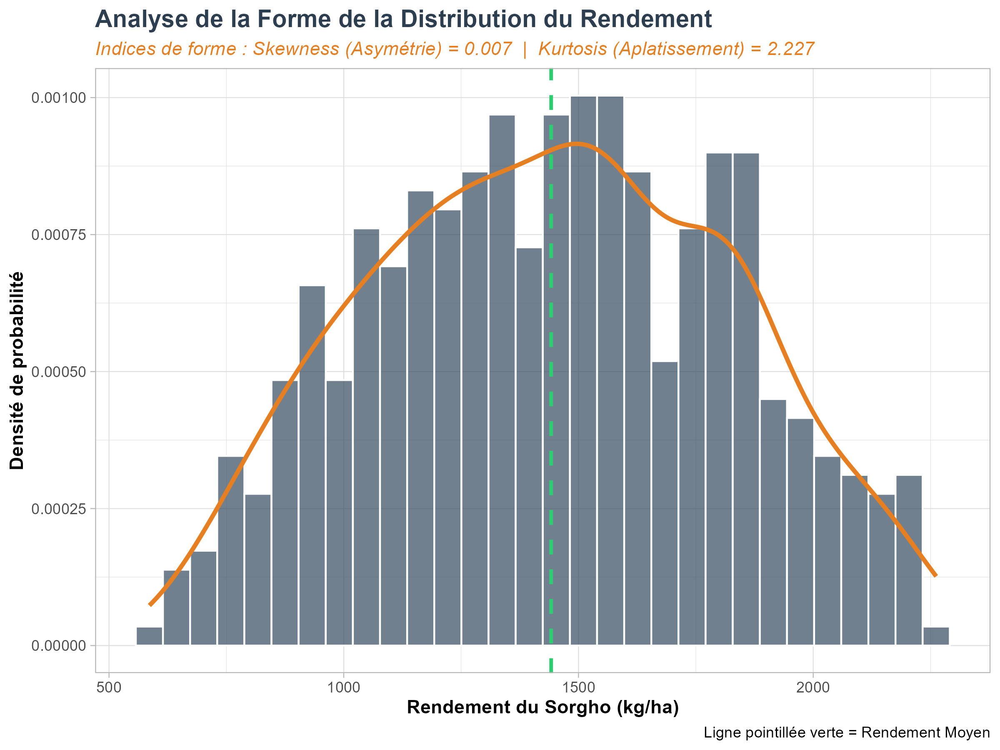
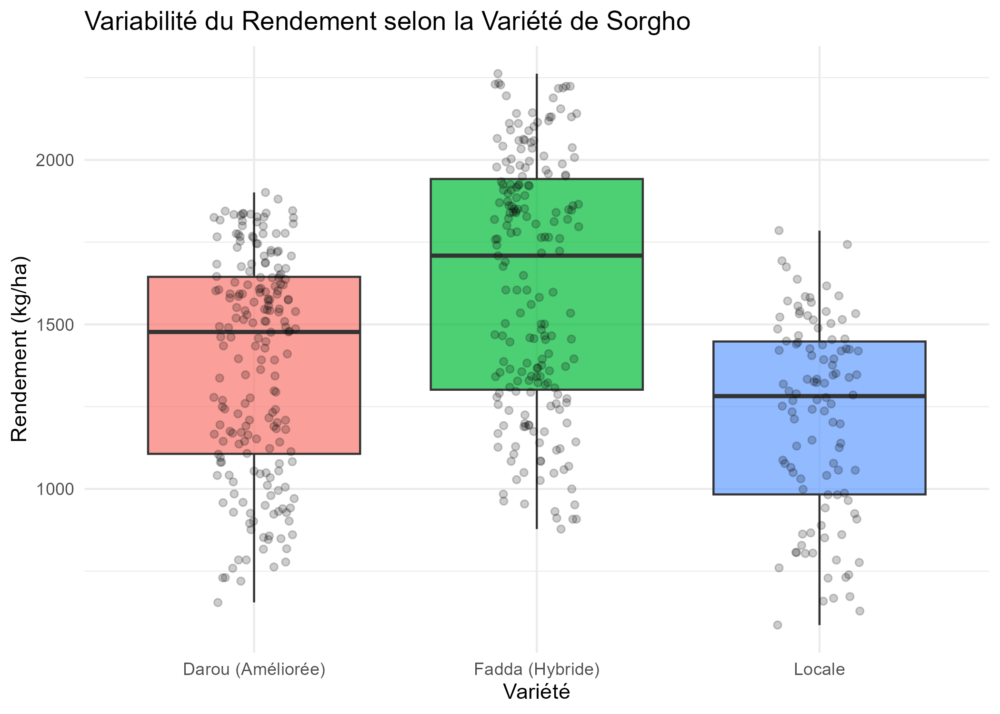
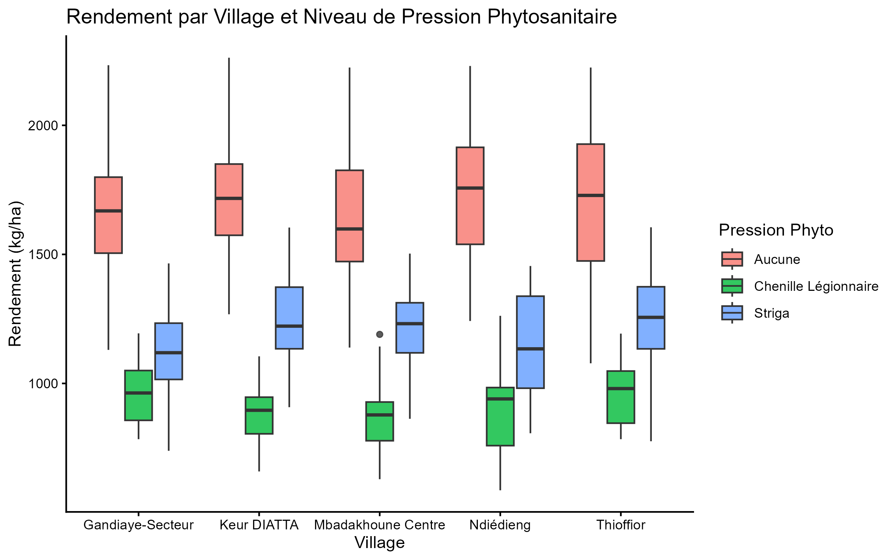
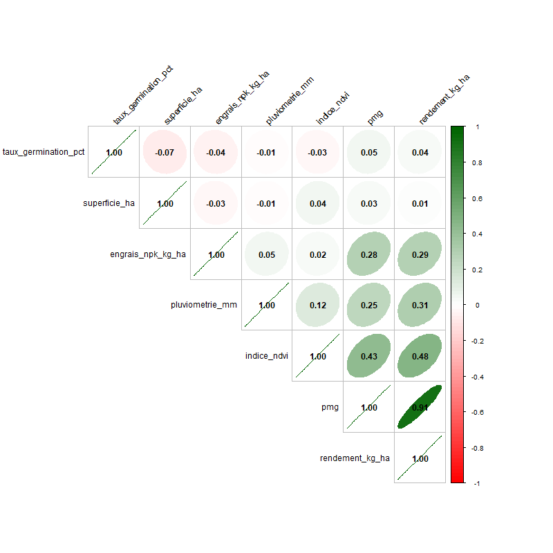
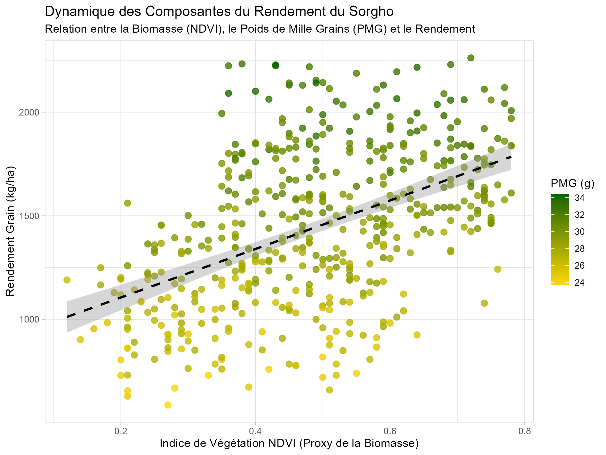
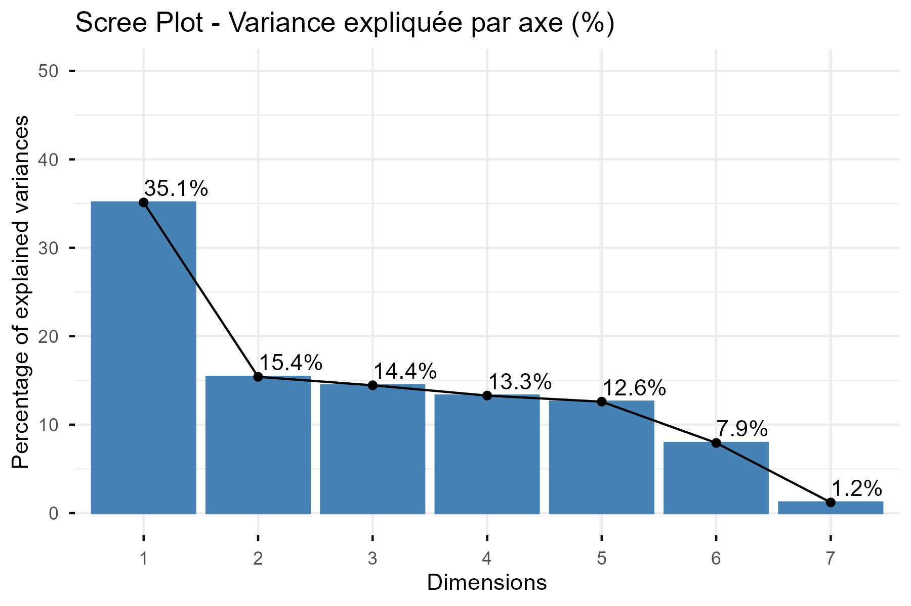
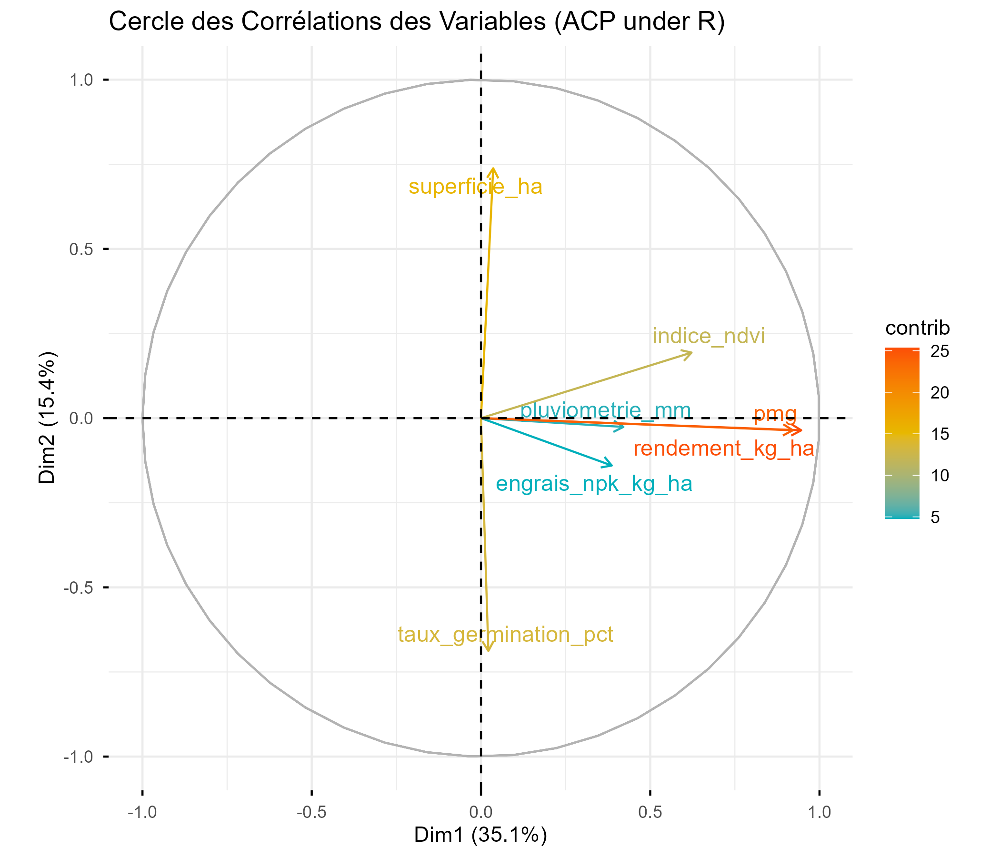
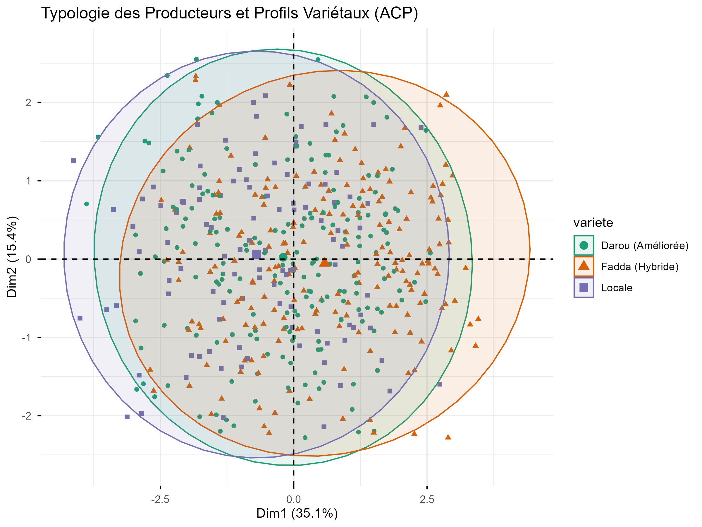

# 🌾 Sorgho Agroecology Analytics - Suivi Technico-Économique & Diagnostics (Projet PEA-PETTAL)

Ce dépôt rassemble l'infrastructure d'analyse de données, la modélisation statistique et la structuration des observations de terrain réalisés en tant que **Responsable de production Sorgho** lors de la campagne hivernale 2025. Ce projet s'inscrit dans le cadre du **Projet PEA-PETTAL** au sein de la Ferme Intégrée de l'USSEIN à Mbadakhoune (Région de Kaolack, Sénégal).

L'objectif principal est de piloter et d'évaluer scientifiquement les performances de la culture de sorgho sous conduite agroécologique à travers un pipeline d'analyse de données hybride (**Python & R**).

---

## 🎯 Contexte & Objectifs du Projet
* **Rôle :** Responsable de production Sorgho & Data Analyst.
* **Cadre institutionnel :** Projet PEA-PETTAL, Ferme Intégrée de l'USSEIN.
* **Problématique :** Évaluer l'efficience des leviers de transition agroécologique (gestion des intrants organiques, associations de cultures, lutte intégrée) sur le rendement final et analyser les profils socio-économiques des producteurs de la zone.

---

## 🛠️ Architecture de l'Analyse Métier (Double Approche Data)

Le projet est structuré en deux grands volets de traitement de données pour répondre aux exigences agronomiques du terrain :

### 🐍 Volet 1 : Profilage des Producteurs & Rendements Globaux (Implémentation Python)
Développé sous **Jupyter Notebook**, ce volet se concentre sur l'analyse macro-économique et exploratoire des exploitations :
* **Statistiques Descriptives Avancées :** Nettoyage et structuration des bases de données de la campagne.
* **Analyse en Composantes Principales (ACP) :** Segmentation et typologie des producteurs de sorgho en fonction de leurs pratiques, de leurs contraintes phytosanitaires (pression du *Striga*) et de leurs rendements globaux.
* **Livrables visuels :** Cartographies de corrélations et graphiques ACP en Haute Définition (HD).

## 📊 Volet 2 : Analyse Biométrique Fine, Diagnostics Statistiques & Efficience des Leviers (Implémentation R)

Développé sous RStudio, ce volet traite spécifiquement des données collectées à la récolte auprès d'un échantillon de **500 producteurs de la zone de Mbadakhoune**. L'objectif est d'évaluer la structure des composantes du rendement, de valider mathématiquement les hypothèses de modélisation et de construire une typologie fine des performances agronomiques.

### 1. Variables Établies & Pipeline de Données
Après correction du protocole d'importation (séparateur de champ `,` via `read.csv`), la base de données consolide 11 variables clés :
* **Variables Dépendantes (Composantes du rendement) :** Rendement grain (`rendement_kg_ha`), Poids de Mille Grains (`pmg`, simulé via une loi de distribution biologique dépendante du rendement) et Indice de biomasse foliaire (`indice_ndvi`).
* **Variables Explicatives & Facteurs :** Variété de sorgho (`variete` : Fadda, Darou, Locale), Village (`village` : 5 modalités), et Pression Phytosanitaire (`pression_phytosanitaire` : Aucune, Striga, Chenille Légionnaire).
* **Variables de Conduite :** `superficie_ha`, `pluviometrie_mm`, `engrais_npk_kg_ha` et `taux_germination_pct`.

### 4. Relation Biomasse (NDVI), PMG et Rendement (R_relation_biomasse_pmg_rendement.jpg)
**Observations** : Ce nuage de points montre une trajectoire linéaire ascendante (ligne pointillée). Plus l'indice NDVI (axe X) augmente, plus le rendement (axe Y) grimpe. De plus, les points passent d'un jaune vif (faible PMG ~24g) en bas à gauche à un vert très foncé (fort PMG ~34g) en haut à droite.
**Interprétation** : Ce graphique illustre la physiologie du rendement. Une excellente installation de la biomasse foliaire en début de cycle (NDVI élevé) garantit une forte activité photosynthétique. Lors de la maturation, cette énergie est transférée vers les grains, augmentant leur poids (PMG) et maximisant mécaniquement la récolte.

### 5. Scree Plot - Variance expliquée par axe (R_acp_valeurs_propres.png)
**Observations** : L'axe 1 (Dim1) exprime 35,1 de la variabilité et l'axe 2 (Dim2) exprime 15,4. À eux deux, les deux premiers axes résument 50,5 de l'information totale du fichier.
**Interprétation** : Ce jeu de données est multidimensionnel et varié. Retenir le premier plan factoriel (Dim 1 et Dim 2) pour l'analyse est tout à fait robuste et valide pour construire une typologie des producteurs.

### 6. Cercle des Corrélations des Variables - ACP (R_acp_cercle_variables.png)
**Observations** : Sur l'Axe 1 (Horizontal) : Les variables rendement_kg_ha, pmg et indice_ndvi se projettent ensemble vers la droite (flèches longues et colorées en orange/rouge, indiquant une forte contribution).
Sur l'Axe 2 (Vertical) : La variable superficie_ha (vers le haut) s'oppose directement à taux_germination_pct (vers le bas).
**Interprétation** : L'axe 1 est l'axe de la performance agronomique (Biomasse - Gros Grains - Haut Rendement).
L'axe 2 révèle une contrainte technique d'échelle : les producteurs qui cultivent de très grandes superficies (superficie_ha) obtiennent généralement de moins bons taux de germination (taux_germination_pct). Cela s'explique souvent sur le terrain par une perte de précision technique lors des semis de grande envergure (profondeur de semis mal maîtrisée, lit de semence moins soigné).

### 7. Typologie des Producteurs et Profils Variétaux - ACP (R_acp_individus_varietes.jpg)
**Observations** : Ce graphique projette les 500 producteurs sous forme de points, entourés par les ellipses de confiance à 95% des trois variétés :
L'ellipse orange (Fadda) est nettement décentrée vers la droite (zone de haute performance et gros PMG).
L'ellipse violette (Locale) est décalée vers la gauche (zone de faible productivité).
L'ellipse verte (Darou) est parfaitement centrée au milieu.
**Interprétation** : Ce graphique confirme visuellement l'impact du choix variétal. Les producteurs de Fadda se situent majoritairement dans le groupe des hauts rendements. Cependant, le fort chevauchement des trois ellipses prouve que la variété ne fait pas tout : un producteur de variété locale sans attaque de chenilles et avec une bonne fertilisation surperformera toujours un producteur de Fadda dont la parcelle a été dévastée par les insectes ou le Striga.

### 8. Diagnostics de Forme et Tests de Normalité (Robustesse)
Avant toute modélisation paramétrique, la distribution du critère majeur (`rendement_kg_ha`) a été soumise à une batterie de tests de validation :
* **Indices de Forme :** Un coefficient d'asymétrie de **Skewness = 0.007** démontre une symétrie parfaite de la distribution. L'aplatissement de **Kurtosis = 2.227** (< 3) révèle une courbe platykurtique, caractérisant une hétérogénéité structurelle saine des performances sur le terrain sans concentration excessive autour de la moyenne.
* **Validation de la Normalité :** Face à un échantillon large (n=500), le test de *Shapiro-Wilk* montre une ultra-sensibilité aux légers écarts d'aplatissement (p-value = 0.00015). Cependant, le test global de **Kolmogorov-Smirnov (p-value = 0.2311)** accepte formellement l'hypothèse nulle (H_0), autorisant l'assimilation à une loi normale et l'usage robuste d'outils paramétriques.
* **Homoscédasticité (Test de Bartlett) :** Le test d'égalité des variances appliqué aux variétés rejette l'homogénéité (K^2 = 9.24, p-value = 0.0098). Agrobiologiquement, cela prouve que la volatilité du rendement varie selon le matériel génétique : l'hybride *Fadda* montre une forte réactivité aux variations de l'itinéraire technique (haut risque / haute performance), tandis que la variété *Locale* s'avère plus stable mais plafonnée.

### 9. Modélisation Inférentielle & Tests d'Hypothèses
* **Déterminisme du Rendement (Test de Pearson) :** Le test de corrélation linéaire entre le rendement et le poids des grains révèle un lien positif d'une intensité exceptionnelle (**r = 0.911** ; p-value < 2.210^-16).
Le remplissage des grains (PMG) est scientifiquement identifié comme le levier physiologique n°1 du rendement dans la zone.
* **Distribution des Menaces (Test du Khi-deux chi^2) :** Le croisement qualitatif entre le *Village* et la *Pression Phytosanitaire* confirme l'indépendance géographique de la menace (chi^2 = 9.20, **p-value} = 0.3257**). Le *Striga* et la *Chenille Légionnaire d'Automne* frappent de manière globale et homogène l'ensemble du territoire de Mbadakhoune, imposant une stratégie de lutte macro-régionale.

### 10. Analyse Multivariée (ACP) & Typologie des Producteurs
Pour synthétiser la matrice de variance-covariance des 500 exploitations, une Analyse en Composantes Principales (ACP) a été exécutée :
* **Inertie (Scree Plot) :** Le premier plan factoriel résume **50.5% de l'information totale** (Dim 1 : 35.1% ; Dim 2 : 15.4%), assurant une réduction dimensionnelle hautement fiable.
* **Cercle des Corrélations :** L'Axe 1 définit *l'axe de performance agronomique*, associant fortement le NDVI, le PMG et le Rendement. L'Axe 2 met en évidence une *contrainte technique d'échelle*, illustrant une opposition marquée entre la taille des exploitations (`superficie_ha`) et la qualité du semis (`taux_germination_pct`).
* **Espace des Individus & Profils Variétaux :** La projection des producteurs sous ellipses de confiance à 95% valide la supériorité de l'hybride **Fadda** (centré sur la zone des hauts rendements), le caractère intermédiaire de **Darou**, et le décrochage de la variété **Locale**, tout en nuançant l'impact de l'itinéraire technique individuel (chevauchement partiel des profils).

### 11. Pipeline de Visualisation et Livrables Graphiques (`ggplot2`)
Le script exporte et actualise automatiquement dans le répertoire de travail `/Projet_Sorgho` les figures haute résolution (`.png`, 300 DPI) suivantes :

Histogramme de densité avec ajustement gaussien (Skewness/Kurtosis). 

Distribution du rendement combinée avec affichage des points individuels (*jitter*)

### 1. Variabilité du Rendement selon la Variété (R_boxplot_rendement_variete.jpg)
**Observations** : Ce graphique en boîtes à moustaches montre une hiérarchie nette. La variété hybride Fadda domine avec le rendement médian le plus élevé (autour de 1700 kg/ha).
Darou (variété améliorée) se situe au centre avec une médiane proche de 1500 kg/ha. La variété Locale est en retrait avec une médiane à environ 1300 kg/ha.
**Interprétation** : L'introduction des semences certifiées (Fadda et Darou) est un succès technique. L'hybride Fadda exprime un fort potentiel génétique. Cependant, le grand étalement des points individuels (jitter) montre que la variété ne fait pas tout : un mauvais itinéraire technique peut faire chuter le rendement d'un hybride au niveau d'une variété locale.

 Impact croisé des bio-agresseurs par zone géographique
  : 

### 2. Rendement par Village et Niveau de Pression Phytosanitaire (R_boxplot_rendement_village_phyto.png)
**Observations** : Le comportement des rendements est strictement identique dans les 5 villages (Gandiaye, Keur Diatta, Mbadakhoune, Ndiédieng, Thioffior).
Aucune pression (Rouge) : Le rendement est optimal, entre 1600 et 1900 kg/ha.
Striga (Bleu) : Le rendement chute et plafonne entre 1100 et 1300kg/ha.
Chenille Légionnaire (Vert) : C'est l'effondrement global, les rendements tombent tous sous la barre des 1000 kg/ha.
**Interprétation** : La pression biotique est le principal facteur limitant de la zone, et ce fléau est macro-régional (il frappe de la même façon partout). Si le Striga (plante parasite) pénalise la récolte en volant les nutriments aux racines, la Chenille Légionnaire d'Automne est une catastrophe majeure qui détruit l'appareil foliaire et annule instantanément le potentiel de la culture.

Graphique d'ellipses de corrélations de Pearson

### 3. Matrice de Corrélation (R_matrice_correlation.png)
**Observations** : La corrélation la plus intense et la plus visible (ellipse verte très étirée) est celle entre rendement_kg_ha et pmg avec un coefficient de r = 0,91. Le rendement est également corrélé positivement à l'indice de biomasse indice_ndvi (r = 0,48).
**Interprétation** : D'un point de vue mathématique, le rendement du sorgho à Mbadakhoune est directement dicté par le remplissage du grain (le Poids de Mille Grains). Plus les grains sont lourds, plus le rendement final en kg/ha est élevé.

7.  : Nuage de points trivarié (NDVI vs Rendement indexé sur le gradient de PMG).
8.  
9.  
10.   : Triptyque complet de l'analyse factorielle.
11.  `analyse_sorgho_kaolack.ipynb` : Notebook Jupyter contenant le code Python (Nettoyage, Statistiques descriptives, ACP).
12.  `analyse_biometrique_rendement.R` : Script R pour l'évaluation fine des composantes du rendement et tests d'efficience agroécologique.
13.  `producteurs_sorgho_mbadakhoune.csv` : Base de données brute centralisant les relevés phénologiques, phytosanitaires et biométriques.
---

## 🧰 Compétences Data & Thématiques Clés Mobilisées

* **Langages & Environnements :** Python (`Pandas`, `Seaborn`, `Scikit-learn`) | R (`Tidyverse`, `ggplot2`) | Jupyter Notebook | RStudio
* **Agronomie de Terrain :** Itinéraires Techniques, Diagnostics Phytosanitaires (Suivi du *Striga*), Relevés Phénologiques.
* **Science des Données :** Analyse Multivariée (ACP), Biostatistiques, Analyse de Variance, Visualisation de Données HD.

---
🔬 *Projet réalisé à la Ferme Intégrée de l'USSEIN - Contenus et codes open-source pour le développement de l'agroécologie au Sénégal.*
